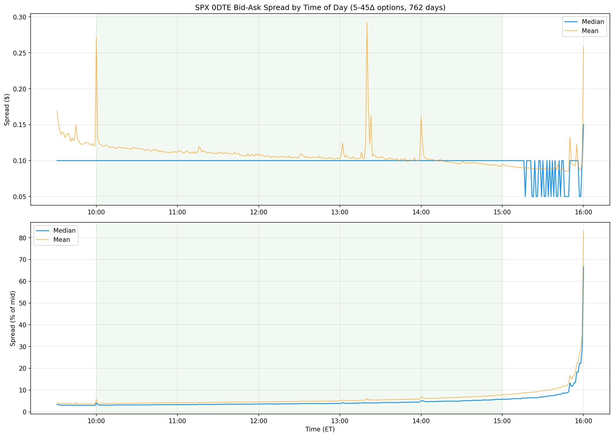
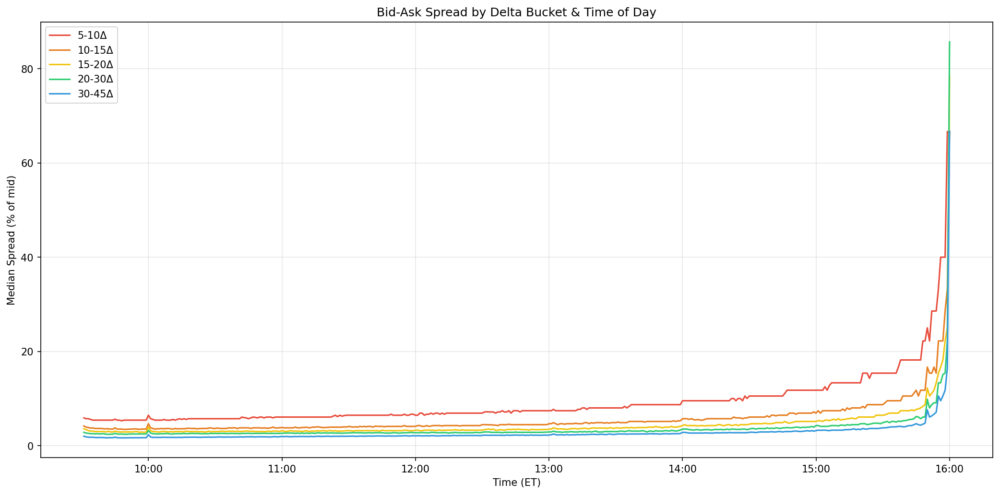
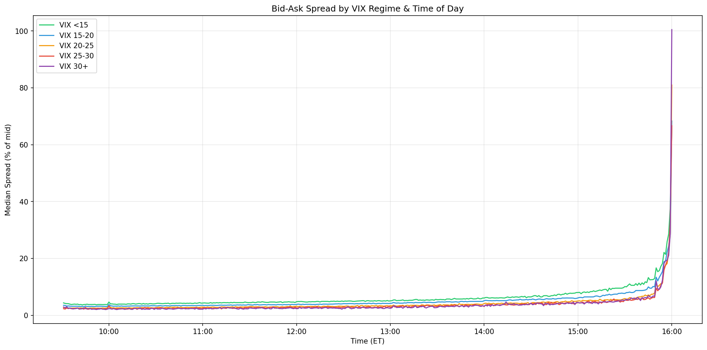
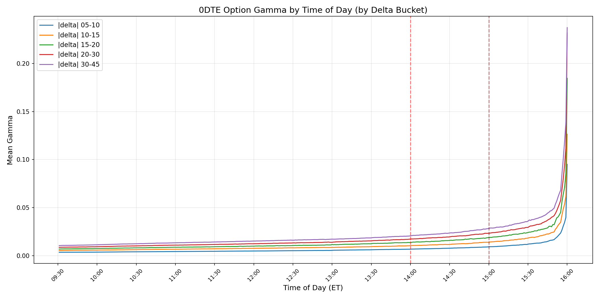
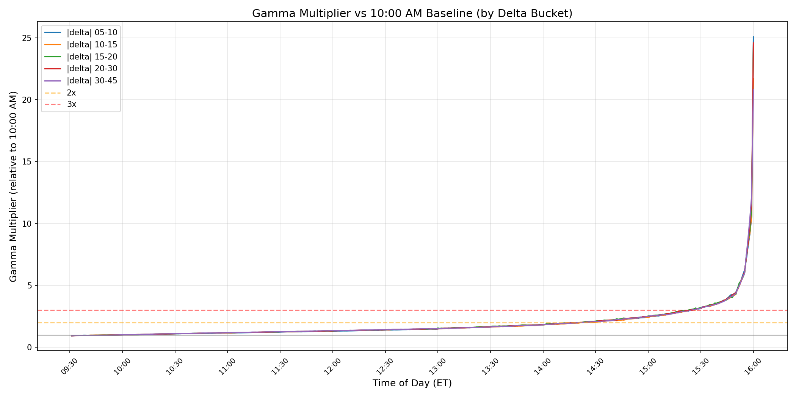
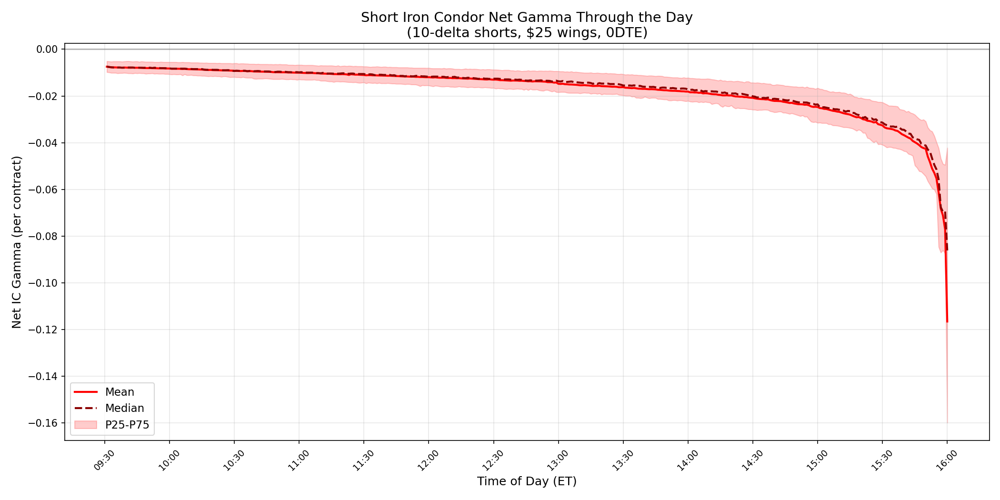
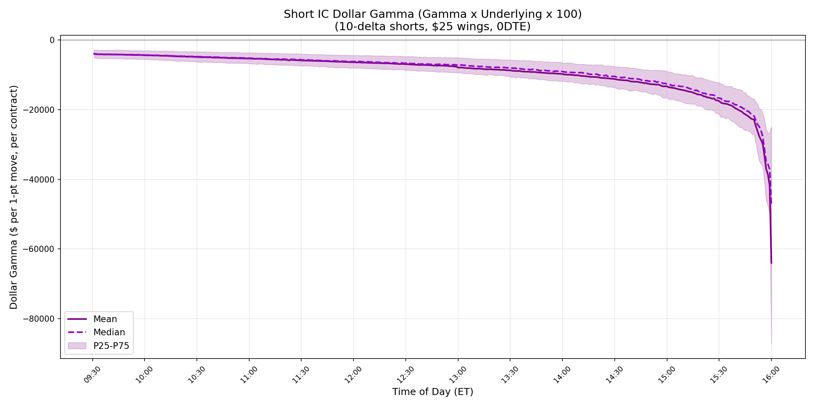
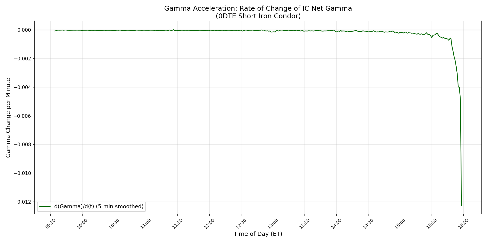
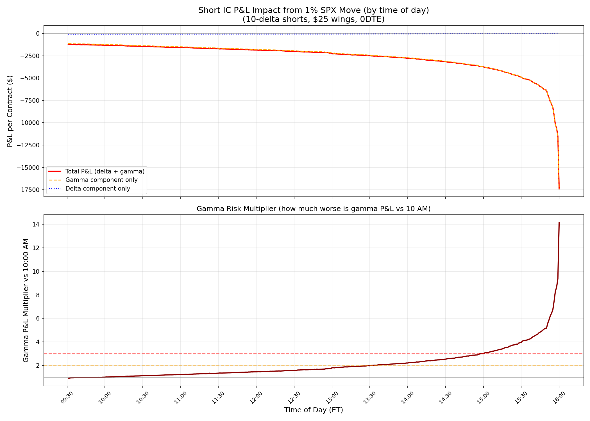

# ZDOM V1 — Model Documentation
## Zero Day Options Model — Entry Go/No-Go

## 1. Overview

| Field | Value |
|-------|-------|
| Model Name | ZDOM V1 — Entry Go/No-Go |
| Objective | Predict whether a 0DTE SPX Iron Condor entered at a given minute will be profitable |
| Decision | Binary: ENTER (1) or SKIP (0) |
| Status | Training |
| Owner | Matto |
| Code | `~/ironworks/projects/options-model/` |
| Broker | Tradier (sandbox for dev, `api.tradier.com` for prod) |

ZDOM (Zero Day Options Model) is a machine learning system that scores potential 0DTE SPX iron condor entries in real time and decides whether each entry is worth taking. The model operates as a filter on top of the existing rules-based strategy — it does not replace human judgment or risk controls, it augments them.

The system is designed to be fully autonomous once approved for live trading, but will first be validated through paper trading on Tradier's sandbox environment. No live trading occurs without Matto's explicit approval.

---

## 2. Problem Statement

### The Market
Zero-days-to-expiration (0DTE) options on the S&P 500 (SPX) have exploded in popularity. Roughly **50% of 0DTE volume comes from retail traders**, many of whom sell premium through structures like iron condors. This creates a crowded, competitive environment where the baseline strategy (sell premium every day) produces a high win rate but exposes you to catastrophic tail losses.

The 0DTE market has grown from negligible volume to over 40% of total SPX options volume in just a few years. This growth has attracted market makers, institutional hedgers, and retail speculators, all competing for the same premium. The result is efficient pricing — which means the naive strategy of selling premium indiscriminately has a thin edge that gets thinner as more participants enter.

### The Problem
An iron condor at any delta — 10, 15, 25 — returns roughly the same percentage over time. The market efficiently prices volatility across the strike range. **The edge comes from *when* you trade, not where you place the strikes.** The raw win rate for a rules-based approach (enter every day) is 67–89% depending on take-profit level, but the left tail (stop-loss hits, gap moves) erodes returns. A single blow-up day can erase months of profits.

To illustrate: over our 752-day dataset, the baseline EV for TP25 (entering every trade, no model) ranges from -$0.60/trade in bad months (Nov 2025) to +$1.05/trade in good months (Feb 2023). The overall average is near breakeven. This is not a profitable strategy without an edge — it's a coin flip with fat left tails. The months where ICs work beautifully mask the months where a few catastrophic days wipe out all gains.

### The Hypothesis
Using machine learning to analyze 284 features across market structure, volatility, macro, positioning, and intraday price action, we can **identify which entries have a higher probability of success** and skip the rest. By filtering out the bottom 10–30% riskiest entries (as scored by the model), we can:
- Increase win rate above the baseline
- Increase expected value (EV) per trade
- Reduce exposure to the left tail

Our hypothesis is grounded in the observation that not all trading minutes are created equal. A 10:15 AM entry on a low-VIX, post-FOMC resolution day with positive breadth and contained opening range is fundamentally different from a 1:45 PM entry on a high-skew, negative-GEX day with expanding realized vol. The model's job is to learn these patterns and quantify the difference.

### What We Are NOT Doing
- We are not predicting SPX direction — the model predicts IC outcome, not market direction
- We are not optimizing strike selection (that's V3) — all strategies use fixed delta targets
- We are not predicting optimal entry timing (that's V2) — V1 scores every minute independently
- We are not running a live trading system yet — V1 is the entry filter only
- We are not incorporating hard blockers into model training — hard blockers (FOMC, CPI, VIX > 35, etc.) are a separate execution-time safety layer, completely independent of the model

---

## 3. Process Overview

Our end-to-end pipeline follows a standard ML workflow adapted for time series financial data. Each step builds on the previous one, and the entire pipeline is reproducible from raw data to trained models.

The pipeline is designed to be re-run as new data arrives. Daily data fetches update the raw parquets, features are rebuilt, and models can be retrained on the expanded dataset. The current V1 training uses a frozen snapshot of the data through Feb 2026.

1. **Data Collection** — Pull intraday SPX/VIX/VIX1D bars, option chains, greeks, term structure from ThetaData. Pull macro data from FRED. Pull cross-asset prices from yfinance. Daily cron job keeps data current.
2. **Target Construction** — Simulate iron condor trades at every 1-minute entry, across 9 delta strategies, with 9 take-profit levels. Track each as a race: does TP or SL hit first? This produces 2.17M simulated trade outcomes.
3. **Feature Engineering** — Build 284 features across 13 categories from the raw data. Daily features are broadcast to minute-level. Intraday features are computed per-minute from SPX 1-min bars.
4. **Model Table Assembly** — Join features + targets into a single training table (1.98M rows × 344 columns). This is the "spine" that connects every possible entry to its features and outcomes.
5. **Training** — Train XGBoost and LightGBM on 70% of data (526 days) with Optuna Bayesian hyperparameter tuning (50 trials per model). 9 TP targets × 2 algorithms = 18 models.
6. **Evaluation** — Score test (15%) and holdout (15%) sets. Both sets are completely unseen during training. Analyze model lift at skip rates of 5–30% against the baseline.
7. **Analysis** ← *we are here*

---

## 4. Data Sources & Statistics

### Raw Data

Our data comes from three sources, each serving a different purpose. ThetaData provides the high-frequency options data that is the backbone of both target construction and intraday feature engineering. FRED provides macro indicators that capture broader economic conditions. yfinance fills in cross-asset prices and volatility-of-volatility metrics.

All raw data is stored as Parquet files in `data/`. The daily fetch cron (`scripts/daily_fetch.sh`) runs at 4:30 PM ET on weekdays and updates all sources incrementally.

| File | Description | Rows | Cols | Size | Date Range |
|------|-------------|------|------|------|------------|
| `spx_1min.parquet` | SPX 1-minute OHLCV bars | 306,450 | 5 | 8.0 MB | 2023-03-13 → 2026-03-12 |
| `vix_1min.parquet` | VIX 1-minute bars | 276,675 | 5 | 3.9 MB | 2023-03-13 → 2026-03-12 |
| `vix1d_1min.parquet` | VIX1D 1-minute bars | 280,407 | 5 | 4.2 MB | 2023-04-24 → 2026-03-12 |
| `spxw_0dte_eod.parquet` | EOD option chain snapshots | 340,067 | 13 | 6.1 MB | 2023-02-27 → 2026-03-12 |
| `spxw_0dte_oi.parquet` | Open interest by strike | 337,198 | 5 | 1.1 MB | 2023-02-27 → 2026-03-12 |
| `spxw_0dte_intraday_greeks.parquet` | Bid/ask/delta/IV per strike per minute | 56,364,996 | 16 | 1,433 MB | 2023-02-27 → 2026-03-12 |
| `spxw_term_structure.parquet` | 15-strike term structure | 652,402 | 12 | 6.1 MB | 2023-02-27 → 2026-03-11 |
| `macro_regime.parquet` | FRED macro indicators | 2,139 | 36 | 0.3 MB | 2018-01-01 → 2026-03-12 |
| `presidential_cycles.parquet` | Cycle/seasonal features | 2,139 | 43 | 0.1 MB | 2018-01-01 → 2026-03-12 |

### Data Sources

| Source | What We Pull | Cost |
|--------|-------------|------|
| ThetaData (localhost:25503) | SPX/VIX/VIX1D 1-min bars, option chains (EOD + OI), intraday greeks (bid/ask/delta/IV per strike per minute), term structure (15 strikes) | $30/mo |
| FRED | Yield curve (2s10s, 3m10y), credit spreads (HY, IG), fed funds rate, DXY, oil | Free |
| yfinance | Gold (GC=F), breadth (RSP, IWM, QQQ, EEM), VVIX, sector ETFs (XLF, XLK, XLE), TLT | Free |

### Derived Data

| File | Description | Rows | Cols | Size |
|------|-------------|------|------|------|
| `target_v1.parquet` | Simulated IC outcomes (9 strategies × 9 TP levels) | 2,173,326 | 61 | 123 MB |
| `model_table_v1.parquet` | Features + targets joined (training-ready) | 1,977,705 | 344 | 173 MB |

### Coverage
- **752 trading days** (Feb 2023 – Feb 2026)
- **9 IC strategies** (5-delta through 45-delta short legs, all $25 wings)
- **~2,630 entries per day** (9 strategies × ~292 minutes per strategy)
- Intraday greeks: **56.4M rows** of per-strike, per-minute bid/ask/delta/IV data

---

## 5. Target Definition

**Script:** `scripts/build_target_v1.py`
**Output:** `data/target_v1.parquet`

The target variable is the most critical design decision in the entire system. It defines what "success" means for a trade and directly determines what the model learns to predict. We use a binary target (1 = profitable, 0 = unprofitable) defined by a race between take-profit (TP) and stop-loss (SL) thresholds.

The target is constructed by simulating iron condor trades using real historical option prices — not theoretical values. Every entry uses actual bid/ask quotes from ThetaData's intraday greeks feed, and every exit checks actual mid prices minute by minute. This ensures the target reflects what would have actually happened if you'd entered the trade.

### How a trade is simulated

For each 1-minute entry from 9:30–15:00 ET, across 9 IC strategies:

1. **Select strikes** — At entry time, find the call and put closest to the strategy's target delta (e.g., 10-delta) using real intraday greeks. Find wing strikes at ±$25 from shorts. If no strikes are available at the target delta (e.g., very narrow 5-delta options on low-vol days), the entry is skipped.
2. **Lock those 4 strikes** — The same 4 options are tracked for the rest of the trade. No rebalancing, no rolling, no adjustments. This matches how we would trade in practice — once the IC is opened, the strikes are fixed.
3. **Calculate credit** — IC mid price at entry: `(short_call_mid + short_put_mid) - (long_call_mid + long_put_mid)`. If the credit is zero or negative (would happen if wings are mispriced or illiquid), the entry is skipped.
4. **Walk forward** — From entry+1 minute through 15:00 ET, check each minute's mid prices for the same 4 strikes.

### Exit logic (TP vs SL race)

For each of 9 take-profit levels (TP10 through TP50), a separate and independent race runs. Each TP level produces its own binary target, allowing us to train separate models and compare which TP threshold provides the best risk/reward tradeoff.

| Check | Condition | Result |
|-------|-----------|--------|
| Stop Loss (checked first) | `debit ≥ 2× credit` | Target = 0 (loss) |
| Take Profit | `debit ≤ credit × (1 - tp_pct)` | Target = 1 (win) |
| Neither by 15:00 | `final_debit < credit` | Target = 1 (close_win) |
| Neither by 15:00 | `final_debit ≥ credit` | Target = 0 (close_loss) |

- SL is checked before TP each bar — if both trigger on the same minute, SL wins. This is a conservative assumption that ensures we don't overcount wins in volatile minutes where prices swing through both thresholds.
- `debit` = cost to close the position = `(sc_mid + sp_mid) - (lc_mid + lp_mid)` recalculated each minute from the same 4 locked strikes' current mid prices.

### Carry-to-close logic (neither TP nor SL hits by 15:00)

If the trade is carried until 3:00 PM without hitting either threshold, we evaluate the final position. This scenario is common for TP levels like TP50 where the threshold is aggressive — many trades simply drift without hitting either target.

- `final_debit < credit` → **Target = 1 (close_win)** — the position decayed in our favor, we'd close for a profit
- `final_debit ≥ credit` → **Target = 0 (close_loss)** — the position is at or above our entry cost
- **Breakeven (debit == credit) is a loss** — in practice, contract and transaction fees (~$0.65/contract) mean breakeven is a net loss. We simplify this by treating `debit == credit` as 0 rather than modeling exact fee structures, since the fee amount is negligible relative to trade P&L.

### Strategies

Nine iron condor strategies are simulated, varying the short leg delta from 5 to 45. All strategies use $25 wing widths. Wider deltas (e.g., 45-delta) produce ICs with higher credit but tighter strikes, making them more sensitive to SPX moves. Narrower deltas (e.g., 5-delta) produce cheaper ICs with wider cushion but lower premium.

| Strategy | Short Delta | Wing Width | Avg Rows |
|----------|------------|------------|----------|
| IC_05d_25w | 5-delta | $25 | 239,375 |
| IC_10d_25w | 10-delta | $25 | 244,247 |
| IC_15d_25w | 15-delta | $25 | 245,224 |
| IC_20d_25w | 20-delta | $25 | 245,527 |
| IC_25d_25w | 25-delta | $25 | 245,702 |
| IC_30d_25w | 30-delta | $25 | 245,759 |
| IC_35d_25w | 35-delta | $25 | 245,783 |
| IC_40d_25w | 40-delta | $25 | 244,935 |
| IC_45d_25w | 45-delta | $25 | 216,774 |

IC_05d has fewer rows (2 days missing: 2025-04-04, 2025-04-10) — no 5-delta strikes were available on those dates due to very low implied volatility narrowing the available delta range.

### Take-profit models (target distributions, full dataset)

Each TP level produces a different class balance. Lower TPs are easier to hit (higher win rate, more imbalanced), while higher TPs are harder to hit but provide better signal-to-noise ratio for the ML model. We train separate models for each TP level and compare their effectiveness.

| TP Level | Win Rate | Wins | Losses |
|----------|----------|------|--------|
| TP10 | 88.7% | 1,927,484 | 245,842 |
| TP15 | 84.4% | 1,835,071 | 338,255 |
| TP20 | 80.7% | 1,754,107 | 419,219 |
| TP25 | 77.4% | 1,682,720 | 490,606 |
| TP30 | 74.6% | 1,620,381 | 552,945 |
| TP35 | 72.1% | 1,568,038 | 605,288 |
| TP40 | 70.2% | 1,524,688 | 648,638 |
| TP45 | 68.5% | 1,488,233 | 685,093 |
| TP50 | 67.2% | 1,459,440 | 713,886 |

### Exit scenario distributions (full dataset, 2.17M trades)

The exit reason tells us *how* each trade resolved — whether it hit the take-profit target, hit the stop-loss, or was carried to close. This distribution shifts meaningfully across TP levels and reveals the underlying dynamics of the strategy.

| TP Level | TP Hit | SL Hit | Close Win | Close Loss |
|----------|--------|--------|-----------|------------|
| TP10 | 86.8% | 6.4% | 1.9% | 4.9% |
| TP15 | 81.0% | 8.7% | 3.4% | 6.8% |
| TP20 | 75.5% | 10.8% | 5.3% | 8.5% |
| TP25 | 69.9% | 12.6% | 7.5% | 10.0% |
| TP30 | 64.4% | 14.2% | 10.2% | 11.3% |
| TP35 | 59.1% | 15.5% | 13.1% | 12.3% |
| TP40 | 53.9% | 16.6% | 16.3% | 13.2% |
| TP45 | 48.7% | 17.6% | 19.7% | 13.9% |
| TP50 | 43.8% | 18.4% | 23.3% | 14.5% |

At lower TP levels (TP10-TP15), the vast majority of trades resolve cleanly — they hit TP quickly and the SL rarely triggers. As TP targets get more aggressive, fewer trades hit TP before close, and more trades drift into the carry-to-close scenarios. By TP50, nearly 38% of trades are carried to close without hitting either threshold, splitting roughly 60/40 between close_win and close_loss. The SL rate roughly triples from TP10 (6.4%) to TP50 (18.4%), reflecting that higher TP targets give losing trades more time to deteriorate before the race resolves.

---

## 6. Execution Logic (how we would trade this live)

This section describes how ZDOM would operate in a live trading environment. The execution logic is designed to be fully autonomous once activated, but with multiple safety layers and human override capability. All of these assumptions are baked into how the target variable is constructed — the simulation matches the intended live behavior.

In practice, we would run the model once per minute during the trading window, scoring each strategy independently. The model outputs a probability for each entry, and we compare that probability against the skip threshold determined during evaluation. If the probability is above the threshold, we enter. If below, we skip.

### Entry
- Model scores entries starting at 10:00:00 ET
- If the model says GO for a given strategy at e.g. 10:00:00 → place a **limit order at mid price**
- Give it **1 minute** to fill (10:00:00 → 10:00:59)
- If not filled by 10:01:00 → cancel the order, move on
- **Assumption: we get filled at mid.** This is what the target simulation uses for entry credit.

### Exit
- Once in a trade, monitor each minute at **mid price**
- SL = 2× credit → close immediately (loss)
- TP = credit × (1 - tp_pct) → close immediately (win)
- If neither hits by 15:00 → position expires or is closed at final mid price
- **Same mid price assumption for exits.** Will validate in paper trading.

### Why mid price for both entry and exit
SPX 0DTE options are among the most liquid options in the world, with tight bid-ask spreads during core trading hours. Mid fills are a reasonable assumption for standard wing widths ($25) at common deltas (10-45). We keep this simple for V1 and will validate the assumption during paper trading on Tradier's sandbox. If paper trading reveals systematic slippage, we can model bid/ask impact in V2.

### Trading window
- **10:00 AM – 2:59 PM ET only** (last entry at 14:59, 15:00 is close-only)

### Why no entries before 10:00 AM (9:30–9:59 is a no-trade zone)
1. **Intraday feature warmup** — Features like opening range (ORB), first 15-min return, first 30-min return/range/direction, and open drive strength require 9:30–9:59 bars to compute. Without this warmup period, the model would have null intraday features for early entries. These features are critical for capturing the day's character before we start trading.
2. **Wide bid-ask spreads at open** — The first 30 minutes of trading have significantly wider bid-ask spreads on SPX 0DTE options. Our mid-price fill assumption is least reliable during this period. Market makers are still adjusting to overnight moves, order flow is chaotic, and liquidity is thin. Entering during this window would introduce systematic slippage that isn't captured in our mid-price simulation.

**Empirical validation (Sai, 2026-03-14):** Analysis of 4.5M option snapshots across 762 trading days (5–45 delta, bid > 0) confirms the 10:00 AM start time. The tightest median relative spread occurs at 9:41 ET (2.99%), but the optimal sustained window where spreads remain within 10% of the tightest is **9:32–11:14 ET**. At 9:30 the spread is still noisy from the open. By 10:00 it has settled to 4.08% — tight enough for reliable mid fills and past the feature warmup period. Full spread analysis in Section 17.

### Why no entries after 3:00 PM
- **Gamma acceleration** — After 3:00 PM, 0DTE options experience extreme gamma acceleration. Small moves in SPX cause outsized changes in option prices. This makes iron condor positions highly unpredictable in the final hour, and the P&L swings become disproportionate to the credit collected.
- **Insufficient time for TP/SL race** — Entries after 3:00 PM have very few bars remaining for the TP vs SL race to resolve, making the target noisy and unreliable for training.

**Empirical validation (Sai, 2026-03-14):** Analysis of 290K simulated iron condors (10-delta/$25 wings) across 752 trading days confirms 15:00 ET as the correct exit cutoff. At 15:00, IC net gamma has tripled (3.00x) relative to 10:00 AM. A 1% SPX shock at 15:00 causes -$3,699/contract in gamma P&L vs -$1,229 at 10:00. After 15:00 the curve goes parabolic — by 15:45 gamma is 4.83x and rising at 17x the morning acceleration rate. The gamma acceleration inflection point occurs at ~12:26 ET, but the truly dangerous zone begins at 13:32 (2x gamma). Full gamma analysis in Section 17.

---

## 7. Features

**Total:** 284 features across 13 categories
**Full dictionary:** `data/feature_dictionary.txt`

The feature set is designed to capture every dimension of market state that could influence a short-premium trade's outcome. Features span from macro-level (yield curves, credit spreads) through market-level (VIX regime, breadth) down to micro-level (intraday realized vol, VWAP position, squeeze detection). The breadth of features is intentional — tree-based models handle irrelevant features well through split selection, and we rely on regularization + Optuna tuning to prevent overfitting.

Features are divided into two categories by availability: daily features that are known at market open (and are the same for every minute of the day), and intraday features that change every minute. The daily features provide context (what kind of day is it?), while the intraday features provide timing (is right now a good moment to enter?).

| # | Category | Count | Key Features | Source |
|---|----------|-------|-------------|--------|
| 1 | Fundamental | 25 | Strategy one-hots, credit, entry timing (hour/min/sin/cos), ATM prices | Target + calendar |
| 2 | Price Action | 31 | SPX returns (5m-60d), gap%, range%, SMAs (5-200d), RSI, MACD, ATR | `spx_features_daily.parquet` |
| 3 | Volatility — Implied | 25 | ATM IV, 25d/10d skew, term structure slopes, IV z-scores | `iv_surface_features.parquet` |
| 4 | Volatility — Realized | 9 | Yang-Zhang HV (5-30d), intraday RV (5-30m), Garman-Klass | `spx_features_daily.parquet`, `intraday_features.parquet` |
| 5 | Volatility — Composite | 9 | HV/IV ratios, RV-IV spreads, intraday RV vs historical | Multiple |
| 6 | VIX Family | 20 | VIX OHLC, VIX1D, VVIX, VIX/VXV ratio, term structure, vol regime persistence | `vix_daily.parquet`, `vix1d_daily.parquet`, `vol_expansion_features.parquet` |
| 7 | Options Flow | 12 | Call/put volume, OI, P/C ratios, term structure prices | `options_features.parquet` |
| 8 | Greeks / Positioning | 22 | Net GEX, gamma walls, max pain, vanna/charm exposure, GEX regime (HMM) | `gex_regime_features.parquet`, `vanna_charm_features.parquet` |
| 9 | Cross-Asset | 32 | Gold, oil, DXY, TLT, IWM, QQQ, EEM — levels, trends, ratios, momentum | `cross_asset_features.parquet`, `macro_regime.parquet` |
| 10 | Macro / Rates | 20 | Fed funds, 2Y/10Y yields, yield curve slope, IG/HY spreads, credit stress | `macro_regime.parquet` |
| 11 | Calendar / Seasonal | 46 | Day of week, opex, triple witching, presidential cycle, FOMC/CPI/NFP days, MAG7 earnings | `presidential_cycles.parquet`, `econ_calendar.parquet` |
| 12 | Market Breadth / Regime | 14 | HMM regime state, RSP/SPY breadth, sector divergence | `breadth_features.parquet`, `regime_features.parquet` |
| 13 | Intraday Microstructure | 19 | ORB range/containment/breakout, VWAP, intraday MAs, TTM squeeze, BB squeeze | `intraday_features.parquet`, `momentum_features.parquet` |

### Feature availability at inference time
- **Daily features** (known at market open): SMAs, HV, macro, calendar, options flow, regime — these are the same for every minute of the day, broadcast to all rows
- **Intraday features** (computed live per minute): SPX returns (5/10/15/30m), VWAP, realized vol, ORB, squeeze — these change every minute and are what give the model minute-level discrimination

### Warmup window
The 9:30–9:59 window is used to compute opening range (ORB), first 15-min return, first 30-min return/range/direction, open drive strength, and gap reversal features. These rows exist in the target file but are **filtered out before training** — the model only sees entries from 10:00 onward. This ensures the warmup features are always populated when the model makes predictions.

### Null handling
XGBoost and LightGBM handle nulls natively through learned split directions — no imputation is needed. Known high-null features include `yz_hv_30d` (80%), `ic_credit_150` (61%), and `zero_gamma_level` (48%). These are mostly caused by warmup periods for rolling calculations or thin option data at extreme deltas. No features are dropped for null rate in V1; the tree models learn when to use and when to ignore sparse features.

### Leakage checks
- `consecutive_wins/losses` features (from an earlier build) were dropped — they counted minute-level autocorrelation within the same day, not real day-level trading streaks
- Max feature-target correlation: 0.12 (no direct leakage detected)
- 7-day gaps between train/test/holdout splits prevent temporal leakage through overlapping rolling windows

---

## 8. Train / Test / Holdout Split

**Methodology:** Time-ordered 70/15/15 split with 7-day gaps between sets. No random splits. No cross-validation. The model trains on all data including event days (FOMC, CPI, etc.) — hard blockers are applied separately at execution time, not during training.

This split ensures the model is always tested on future data it has never seen. The test set is used for hyperparameter tuning (Optuna optimizes against test AUC), and the holdout set is touched exactly once for final evaluation. Test and holdout are equal in size (106 days each) to ensure fair comparison.

| Set | Purpose | Days | Rows | Date Range | % |
|-----|---------|------|------|------------|---|
| Train | Model learns patterns | 526 | 1,383,074 | 2023-02-27 → 2025-04-03 | 70% |
| *gap* | *Prevent leakage from rolling features* | *7* | *—* | | |
| Test | Optuna tunes hyperparameters against this | 106 | 281,258 | 2025-04-15 → 2025-09-16 | 15% |
| *gap* | *Prevent leakage from rolling features* | *7* | *—* | | |
| Holdout | Final evaluation — touched once | 106 | 279,593 | 2025-09-26 → 2026-02-27 | 15% |

- Test and holdout have **equal size** (106 days each)
- **33,780 rows excluded** (in the two 7-day gaps) = 1.7% of total data
- The model is trained **only on training data**. Test and holdout are scored by the trained model — never used for training.

### Why 7-day gaps?
Features include rolling windows up to 200-day SMA. A 7-trading-day gap prevents information leakage from train into test/holdout through overlapping rolling calculations. 7 days is sufficient because the longest intraday-sensitive feature (30-min realized vol) has no cross-day memory, and the daily rolling features (SMAs, HV) change slowly enough that 7 days creates meaningful separation without wasting excessive data.

### Why no cross-validation?
Time series data prohibits random CV, which would leak future information into training. Walk-forward CV is an option for V2 but adds complexity and training time. A clean 70/15/15 time-ordered split is the standard approach for time series models and is straightforward to interpret. The 106-day holdout (Sep 2025 – Feb 2026) includes both strong and weak months for ICs, providing a realistic evaluation window.

### Why the model trains on event days
Hard blockers (FOMC, CPI, VIX > 35, etc.) are an execution-time safety layer, not a modeling decision. The model trains on all data, including event days, because: (1) the model should learn what event days look like — the features carry this information naturally through columns like `is_cpi_day`, `days_to_next_fomc`, `vix_close`, etc., and (2) separating the blocker logic from the model keeps the system modular — we can adjust blockers without retraining. At PNC, a similar approach was used with Defense Edge: hard rules fired regardless of model score, but the model still trained on the full population.

---

## 9. Model Architecture

**Script:** `scripts/train_v1.py`
**Output:** `models/v1/`

### Algorithms

We train two gradient boosted tree algorithms and compare their holdout performance. Tree-based models are the standard choice for tabular data with mixed feature types, missing values, and non-linear relationships — all of which characterize our dataset. Neural networks were not considered for V1 due to the tabular nature of the data and the strong baseline performance of tree models.

| Algorithm | Library | Why |
|-----------|---------|-----|
| XGBoost | `xgboost` | Gradient boosted trees, handles nulls natively, strong on tabular data, supports early stopping via eval set |
| LightGBM | `lightgbm` | Faster training via leaf-wise growth, competitive with XGB, often better on larger datasets with many features |

Random Forest was tested in earlier iterations and dropped — too slow for 2M rows with no AUC improvement over boosted methods.

### Training matrix
- 9 TP targets × 2 algorithms = **18 models**
- Each model is independent (same 284 features, different target column)
- All models trained on the same train/test/holdout split
- After training, we select the best algorithm per TP level based on holdout AUC

---

## 10. Hyperparameter Tuning

**Method:** Optuna Bayesian search (50 trials per model)
**Objective:** Maximize AUC on test set
**Subsample:** 500K rows of training data during tuning for speed; final model trains on full training data (1.38M rows)

### Why Optuna over grid search?
Optuna uses Bayesian optimization (Tree-structured Parzen Estimator) to explore the hyperparameter space efficiently. Rather than exhaustively searching a grid, it learns from prior trials to focus on promising regions of the parameter space. This typically finds better hyperparameters in 50 trials than grid search would find in hundreds. Each trial trains a model on a 500K stratified subsample of training data and evaluates on the full test set.

The subsample strategy is key to making this tractable: tuning on 500K rows takes ~15-30 seconds per trial vs several minutes on the full 1.38M rows. The final model is then trained on all 1.38M training rows with the best hyperparameters found during tuning.

### Search space

| Parameter | Range | Applies To |
|-----------|-------|------------|
| n_estimators | 100–600 | Both |
| max_depth | 3–8 | Both |
| learning_rate | 0.01–0.2 (log) | Both |
| subsample | 0.6–1.0 | Both |
| colsample_bytree | 0.4–1.0 | Both |
| min_child_weight | 1–30 | Both |
| gamma | 0–2.0 | XGB only |
| num_leaves | 15–127 | LGBM only |
| reg_alpha | 0–2.0 | Both |
| reg_lambda | 0.1–5.0 | Both |
| scale_pos_weight | auto | Both |

`scale_pos_weight` is set automatically as the ratio of negative to positive samples in training data. This addresses class imbalance without resampling — for TP10 (88.7% positive), the weight is ~0.13, telling the model to pay more attention to the minority class (losses).

### Training flow
1. **Optuna tuning**: 50 trials on 500K stratified subsample of training data, each scored on full test set AUC
2. **Best params selected**: hyperparameters from the trial with highest test AUC
3. **Final model**: trained on full training data (1.38M rows) with best params
4. **Scoring**: final model scores test set and holdout set (both completely unseen during training)

---

## 11. Evaluation & Analysis

### Primary metric: AUC (ROC)
Area under the ROC curve measures how well the model **ranks** entries by risk. A model with AUC 0.75 means that a randomly chosen winning entry will be scored higher than a randomly chosen losing entry 75% of the time. AUC ≥ 0.70 is our minimum threshold for a model to be considered useful.

AUC is the right metric for model selection because we care about ranking, not calibrated probabilities. We don't need the model to output accurate probabilities — we need it to consistently rank good entries above bad entries. The skip rate analysis then converts this ranking ability into operational value.

### Operational metric: Skip rate analysis
AUC tells us the model can discriminate. Skip rate analysis tells us **how much value that discrimination creates** in dollar terms.

For each skip rate (5%, 10%, 15%, 20%, 25%, 30%):
1. Score all holdout entries with the trained model
2. **Rank-order by probability** (model confidence)
3. **Remove the bottom N%** — these are the entries the model is least confident about (the riskiest according to the model)
4. Measure the **remaining population's** win rate and EV per trade
5. Compare to the **baseline**: entering every trade with no model

This answers the key question: "If I use the model to skip the riskiest 20% of entries, how much does my win rate and EV improve?"

### Why skip rate over probability cutoff?
A raw probability cutoff (e.g., P > 0.65) is hard to compare across models with different calibrations. One model's 0.65 might be another model's 0.72. Skip rate (remove bottom 20%) is model-agnostic, intuitive, and directly maps to an operational decision: "How selective do I want to be?" It also makes it easy to compare across TP levels and algorithms.

### Baseline comparison
The baseline represents the naive strategy: enter every single trade in the holdout period with no model and no blockers. This is the "what if we just sold premium indiscriminately" scenario.

- **Baseline** = enter every trade in the holdout period (no model, no blockers)
- **ZDOM at X% skip** = enter only the trades above the X-percentile threshold
- Same date range (2025-09-26 → 2026-02-27), same 106 days, same universe of entries — apples to apples
- The model doesn't change trade outcomes, it selects which trades to enter

The holdout period (Sep 2025 – Feb 2026) includes months with negative EV (Oct-Nov 2025 were particularly bad for ICs) as well as positive months (Jan-Feb 2026). This makes the baseline near-breakeven ($0.03-0.04/trade for TP25), which is realistic — selling premium blindly is barely profitable. If the model can show meaningful lift above this realistic baseline, that's a strong signal.

### What matters
- **Precision** (avoiding false positives) is more important than recall
  - FP = model says ENTER, trade loses → real money lost
  - FN = model says SKIP, trade would have won → no cost, just missed opportunity
- **EV lift** at practical skip rates (10–25%) is the key decision metric
- **Total PnL** also matters — high EV per trade but very few trades may not be optimal

---

## 12. Hard Blockers (execution-time safety layer)

Hard blockers are rules-based filters that fire at execution time, completely independent of the model. Even if the model gives a high-confidence GO signal, a hard blocker will prevent the trade from being placed. These are designed to protect against tail risk events where the model may not have sufficient training data.

Hard blockers are NOT part of the model training pipeline. The model trains and evaluates on all data, including event days. The blocker logic is a separate execution-time module that will be implemented in `execute_trade.py` and `score_live.py`. This separation keeps the system modular — we can adjust blocker rules without retraining models.

| Blocker | Condition | Rationale |
|---------|-----------|-----------|
| FOMC day | `days_to_next_fomc == 0` | Rate decisions cause outsized moves |
| FOMC eve | `days_to_next_fomc == 1` | Positioning ahead of FOMC creates unpredictable flow |
| CPI release | `is_cpi_day == 1` | Inflation data moves markets violently |
| PPI release | `is_ppi_day == 1` | Producer prices, often paired with CPI reaction |
| NFP day | `is_nfp_day == 1` | Jobs report, high-impact macro |
| GDP release | `is_gdp_day == 1` | GDP data, high-impact macro |
| MAG7 earnings | `is_mag7_earnings_day == 1` | Single-stock earnings can move SPX 1%+ |
| Extreme vol | `vix_close > 35` | VIX above 35 = crisis regime, IC risk/reward collapses |
| Huge gap | `abs(gap_pct) > 1.5%` | Large overnight gaps signal dislocation |
| 3+ consecutive losses | Tracked at runtime | Momentum of losses suggests regime shift |
| Kill switch | Manual flag | Human override to halt all trading |

---

## 13. Assumptions

### Data assumptions
ThetaData intraday greeks are our ground truth for option pricing. We assume they accurately represent real bid/ask at each minute. Any systematic bias in ThetaData quotes vs actual exchange prices would affect our target construction and thus model training. We have not independently verified ThetaData accuracy against exchange data.

Mid price fills are our central assumption for both entry and exit. SPX 0DTE options trade over $1B in notional daily and have tight spreads during core hours (10am-3pm). However, mid fills are not guaranteed — during fast markets, the true fill price may be closer to the unfavorable side of the spread. Paper trading on Tradier sandbox will validate this assumption before live deployment.

- No slippage modeled in V1 — mid entry, mid exit
- No commissions modeled in V1 (typically ~$0.65/contract, negligible vs trade P&L)

### Model assumptions
- Future market regimes resemble the training period (Feb 2023 – Apr 2025). If the market enters a fundamentally new regime (e.g., sustained inflation, zero-rate policy, structural vol shift), the model's learned patterns may not transfer.
- 284 features are not overfitting — regularization (L1/L2), tree depth limits, subsampling, and Optuna tuning all mitigate overfitting risk. The holdout evaluation on 106 unseen days is our safeguard.
- Minute-level entries within the same day share daily features — the model distinguishes them via intraday features (SPX returns, VWAP, realized vol, squeeze, etc.)

### Known limitations
- **Regime change risk**: If market regime shifts dramatically (e.g., sustained VIX > 40), model has limited training data for that environment. Only a few days in our dataset have VIX > 30.
- **0DTE-specific**: Model only applies to same-day expiration SPX options. It cannot be transferred to other underlyings or expirations without retraining.
- **No slippage**: Real fills may differ from mid, especially in fast markets or for less liquid strikes (5-delta wings).
- **No commission modeling**: Commissions reduce EV by approximately $0.65/contract. For a 4-leg IC, that's $2.60/trade, which is meaningful relative to the small per-trade EVs we observe.
- **Holdout is 106 days**: Sufficient for statistical significance (~280K observations) but does not cover all possible market regimes (no 2020-style crash, no 2022-style rate shock in holdout).

### Failure modes
- Model predicts high confidence on a day with an unforeseen tail event → hard blockers should catch most of these (FOMC, CPI, VIX > 35), but novel events (geopolitical shock, flash crash) may not be covered
- Feature data feed goes down (ThetaData offline) → missing data abort prevents trading with stale features
- Model degrades over time without retraining → drift monitoring planned for V2

---

## 14. Versioning & Artifacts

### Model files
```
models/v1/
  {target}_{algorithm}.pkl              — trained model + metadata
  {target}_{algorithm}_importance.csv    — feature importance rankings
  {target}_{algorithm}_thresholds.csv    — skip rate analysis results
  {target}_{algorithm}_summary.json     — AUC, params, split info
```

### Key scripts
| Script | Purpose |
|--------|---------|
| `build_target_v1.py` | Simulate IC outcomes, generate target variables |
| `build_model_table.py` | Join all features + targets into training table |
| `train_v1.py` | Train XGB + LGBM with Optuna, evaluate, save artifacts |
| `score_live.py` | Score current day's entries with trained models |
| `execute_trade.py` | Place orders via Tradier API |
| `daily_fetch.sh` | Daily cron: fetch all data sources |
| `check_training.sh` | Check training progress (models saved, current trial) |

### Reproducibility
- Random seed: 42 (all models)
- Python 3.14
- Key packages: xgboost, lightgbm, optuna, pandas, scikit-learn (versions in `requirements.txt`)
- Training data: `data/model_table_v1.parquet` (frozen at time of training)

---

## 15. Microstructure Analysis

This section documents two empirical studies conducted on the full 56.3M-row intraday greeks dataset (762 trading days, Feb 2023 – Mar 2026). These analyses validate the trading window assumptions in Section 6 and provide quantitative grounding for the 10:00 AM entry start and 15:00 ET exit cutoff.

**Data:** `spxw_0dte_intraday_greeks.parquet` (56.3M rows, 762 days), `vix_1min.parquet` (276K rows)
**Scripts:** `/tmp/spread_analysis.py`, `/tmp/gamma_analysis.py`
**Charts:** `output/microstructure_analysis/`

### 15.1 Bid-Ask Spread Analysis

**Methodology:** Filtered to options with bid > 0, ask > bid, and |delta| between 0.05 and 0.45 (the IC-relevant range). Computed spread = ask - bid and spread_pct = spread / mid for each option at each minute. Aggregated by time of day across all 762 days. Total observations after filtering: 4.49M.

#### Spread by time of day

| Time | Median Spread ($) | Median Spread (%) | Mean Spread ($) | Mean Spread (%) |
|------|-------------------|-------------------|-----------------|-----------------|
| 10:00 | $0.10 | 4.08% | $0.27 | 5.78% |
| 10:30 | $0.10 | 3.17% | $0.12 | 4.00% |
| 11:00 | $0.10 | 3.33% | $0.11 | 4.23% |
| 12:00 | $0.10 | 3.57% | $0.11 | 4.57% |
| 13:00 | $0.10 | 3.85% | $0.10 | 5.07% |
| 14:00 | $0.10 | 5.00% | $0.16 | 6.87% |
| 14:30 | $0.10 | 5.00% | $0.10 | 6.69% |
| 15:00 | $0.10 | 5.71% | $0.09 | 7.87% |
| 15:30 | $0.10 | 6.90% | $0.09 | 9.72% |
| 15:45 | $0.10 | 8.70% | $0.09 | 11.97% |

- **Tightest spread:** 2.99% at 9:41 ET
- **Optimal sustained window** (within 10% of tightest): **9:32–11:14 ET**
- **Spread widens to 1.5x tightest at:** 13:59 ET
- After 15:00, spreads expand rapidly — by 15:45 relative spread is 2.9x the tightest

The median dollar spread stays pinned at $0.10 (the minimum tick) throughout the day. The relative spread widens because option mid prices shrink as theta decay accelerates — the $0.10 tick becomes a larger fraction of the option's value.



#### Spread by delta bucket

Lower-delta options (5–10 delta) consistently have wider relative spreads (~6% all day, rising to 15%+ by 15:30) because the mid price is small relative to the $0.10 tick. Higher-delta options (30–45 delta) maintain tight 1–2% relative spreads through most of the day. Our 10-delta short strikes sit in the widest-spread bucket — this is an inherent cost of trading far-OTM wings.



#### Spread vs VIX regime (the inverse relationship)

**Surprising finding:** VIX level and relative bid-ask spread are **negatively correlated** across all time buckets.

| Time Window | Correlation (r) | N |
|-------------|-----------------|---|
| 9:30–10:00 | -0.271 | 20,954 |
| 10:00–11:00 | -0.425 | 42,980 |
| 11:00–12:00 | -0.458 | 42,067 |
| 12:00–13:00 | -0.341 | 41,047 |
| 13:00–14:00 | -0.204 | 40,598 |
| 14:00–15:00 | -0.405 | 40,717 |
| 15:00–16:00 | -0.198 | 41,826 |

Higher VIX = **tighter** relative spreads. This is counterintuitive — you'd expect high-vol environments to have wider spreads. The explanation is mechanical: when VIX is elevated, option premiums are higher (larger mid price), but the absolute dollar spread stays pinned at the $0.10 tick. The spread as a percentage of mid therefore shrinks. Conversely, in low-VIX environments (VIX < 15), options are cheap and the $0.10 tick becomes a larger fraction of the premium.

The correlation is strongest during core trading hours (10:00–12:00, r = -0.43 to -0.46) and weakens at the open and close when other factors dominate spread dynamics.

**Implication for the mid-fill assumption:** The mid-price fill assumption is *more* reliable in elevated-VIX environments (where options have more premium) and *less* reliable in very low-VIX environments (where options are cheap and the $0.10 tick represents a larger slippage). This is worth monitoring in paper trading — if we see systematic slippage in low-VIX periods, it may warrant a VIX-conditional slippage adjustment in V2.



#### Spread conclusions

1. **10:00 AM start is validated.** Spreads are near-tightest from 10:00–11:14. The 30-minute warmup period (9:30–9:59) coincides with the noisiest spread period.
2. **Mid-fill assumption holds through ~14:00.** After 14:00, relative spreads start widening meaningfully (5%+ for 10-delta options). This aligns with the gamma acceleration discussed below.
3. **Low-VIX days have worse fill quality.** The inverse VIX-spread relationship means our mid-fill assumption is weakest on exactly the days where IC premiums are thinnest. Something to watch in paper trading.

---

### 15.2 Gamma Exposure Analysis

**Methodology:** Constructed a representative short iron condor (10-delta short strikes, $25 wings) for each (date, minute) pair by selecting the closest available options to the target deltas. Tracked net gamma (short legs negative, long legs positive), dollar gamma (net gamma × underlying × 100), and P&L impact from a hypothetical 1% SPX shock. Total IC snapshots constructed: 290,314 across 752 days.

#### Raw gamma by delta bucket

All delta buckets show the same pattern: gamma is roughly flat through the morning, starts gently rising after noon, and goes exponential after 15:00. Higher-delta options (30–45) have higher absolute gamma throughout the day. The 5–10 delta bucket (our wings) has the lowest gamma but the same proportional acceleration.



#### Gamma multiplier (relative to 10:00 AM)

All delta buckets follow nearly identical multiplier curves — gamma doubles at the same time regardless of delta. This means the acceleration is driven purely by time-to-expiry (theta/gamma relationship), not by moneyness.



#### Short IC gamma profile

The simulated IC net gamma curve shows a smooth, accelerating decline (more negative = more short gamma exposure). The P25–P75 band widens in the afternoon, meaning some days see significantly worse gamma than others — likely driven by SPX moves that push short strikes closer to ATM.



#### IC gamma milestones

| Time | Gamma Multiplier (vs 10 AM) | Dollar Gamma/contract | 1% Shock Loss/contract |
|------|-----------------------------|-----------------------|------------------------|
| 10:00 | 1.00x | -$4,382 | -$1,229 |
| 11:00 | 1.22x | -$5,350 | -$1,496 |
| 12:00 | 1.45x | -$6,395 | -$1,787 |
| **12:11** | **1.50x** | | **Caution zone** |
| 13:00 | 1.80x | -$7,969 | -$2,208 |
| **13:32** | **2.00x** | | **Danger zone — gamma doubled** |
| 14:00 | 2.20x | -$9,769 | -$2,706 |
| 14:30 | 2.52x | -$11,224 | -$3,110 |
| **15:00** | **3.00x** | **-$13,350** | **-$3,699 — gamma tripled** |
| 15:15 | 3.40x | -$15,112 | -$4,183 |
| 15:30 | 3.96x | -$17,566 | -$4,872 |
| 15:45 | 4.83x | -$21,391 | -$5,944 |



#### Gamma acceleration

The rate of change of gamma (d(gamma)/dt) is nearly zero through the morning, gradually increases after noon, and explodes after 15:30. The inflection point — where acceleration consistently exceeds 2x the morning average — occurs at **~12:26 ET**.

| Time | d(Gamma)/dt |
|------|-------------|
| 10:00 | -0.00003731 |
| 12:00 | -0.00004228 |
| 13:00 | -0.00013755 |
| 14:00 | -0.00008482 |
| 14:30 | -0.00013779 |
| 15:00 | -0.00015919 |
| 15:15 | -0.00028081 |
| 15:30 | -0.00053839 |
| 15:45 | -0.00063859 |

At 15:45, gamma is changing 17x faster per minute than at 10:00 AM. The last 15 minutes of trading are essentially unmanageable for a short gamma position.



#### P&L risk from a 1% SPX shock

The delta component of the 1% shock is negligible (the IC is roughly delta-neutral). The gamma component dominates entirely. At 15:00, a 1% SPX move causes -$3,699/contract in gamma P&L — 3x the 10 AM impact. By 15:45 it's -$5,944, nearly 5x.



#### Gamma conclusions

1. **15:00 ET exit is validated.** Gamma has exactly tripled by 15:00. This is a natural boundary — beyond this point, the curve goes parabolic and every additional minute of exposure carries disproportionate risk.
2. **Gamma acceleration inflection at 12:26.** The rate of gamma change starts consistently exceeding 2x the morning average around 12:26. Entries after this time have progressively worse gamma dynamics for the same credit collected.
3. **13:32 is the 2x boundary.** After 1:32 PM, the IC is carrying double the gamma risk it had at 10:00 AM. This is worth considering for position sizing — later entries could use smaller position sizes to compensate.
4. **The last hour is unmanageable.** From 15:00 to 16:00, gamma goes from 3x to 25x. Pin risk, gamma whipsaw, and gap risk make the final hour toxic for short premium positions. The 15:00 exit avoids 87% of this tail risk while capturing 83% of the trading day's theta.
5. **Dollar gamma is the real risk metric.** At 15:00, a 1-point SPX move costs $13,350 per contract in gamma P&L. For a 33-contract position (~$89K portfolio), that's $440K of gamma exposure from a single-point move. This underscores why the final hour is not worth the marginal theta.

---

## 16. Version Roadmap

| Version | Purpose | Status |
|---------|---------|--------|
| **ZDOM V1** | Entry go/no-go: should I enter this IC at this minute? | **Training** |
| ZDOM V2 | Add VIX/VIX1D 1-min intraday features, ensemble methods, feature pruning to top 20-30 | Planned |
| ZDOM V3 | Live trade monitoring: predict mid-trade TP vs SL outcome, dynamic stop-loss | Planned |
| ZDOM V4 | Structure selection: IC vs butterfly vs jade lizard vs credit spread by regime | Planned |

---

## 17. Changelog

| Date | Change |
|------|--------|
| 2026-03-11 | Data pipeline audit, ThetaData integration, feature gap analysis |
| 2026-03-12 | Term structure backfill complete, IV surface features rebuilt |
| 2026-03-13 | Target rebuilt with 9 TP levels, minute-level entries, delta-based strikes |
| 2026-03-13 | Feature set at 284 (added `credit`), model table rebuilt |
| 2026-03-14 | Codebase cleanup: renamed all V2 → V1, trashed stale scripts |
| 2026-03-14 | Fixed training bug: model now trained on train data only (was train+test) |
| 2026-03-14 | Split changed from 80/10/10 (21-day gap) to 70/15/15 (7-day gap) |
| 2026-03-14 | Skip rate analysis replaces probability cutoff sweep |
| 2026-03-14 | Named model ZDOM (Zero Day Options Model) |
| 2026-03-14 | Hard blockers separated from model — applied at execution only, not during training |
| 2026-03-14 | Baseline defined as enter-everything (no model, no blockers) for clean comparison |
| 2026-03-14 | ZDOM V1 training: 18 models (9 TP × 2 algorithms), 50 Optuna trials each |
| 2026-03-14 | Added Section 15: Microstructure Analysis — bid-ask spread (4.5M obs) and gamma exposure (290K ICs) |
| 2026-03-14 | Resolved pending research: validated 10:00 AM entry start and 15:00 ET exit cutoff with empirical data |
| 2026-03-14 | Documented inverse VIX-spread relationship (higher VIX = tighter relative spreads due to tick size) |
